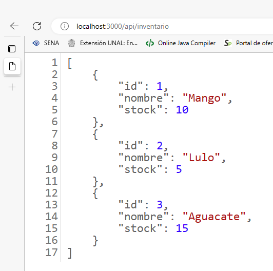

API de Inventario de Frutos Exóticos Colombianos
=============================================

Esta documentación describe la API de Inventario de Frutos Exóticos Colombianos, la cual proporciona información actualizada sobre los niveles de inventario de los productos en un sitio de comercio electrónico. A continuación, se detallan los servicios proporcionados por esta API, su uso para mantener actualizada la información del inventario y cómo ayuda a evitar la venta de productos que están fuera de stock.


---
Para acceder a la información del inventario, puedes hacer una solicitud GET a la siguiente URL: `http://localhost:3000/api/inventario`. Esta API proporciona los datos actualizados sobre los productos disponibles, incluyendo el ID, nombre y stock de cada elemento. Asegúrate de utilizar la URL mencionada y realizar la solicitud adecuada para obtener los detalles del inventario.




---

Endpoint
--------

El endpoint de la API es:

```
/api/inventario
```

Método: GET

---

Servicio: Obtener información del inventario
-------------------------------------------

Descripción: Este servicio devuelve la información del inventario de los frutos exóticos colombianos disponibles en el comercio electrónico.

Endpoint: `/api/inventario`

Parámetros de consulta: Ninguno

Respuesta exitosa:

- Código de estado: 200 (OK)
- Cuerpo de respuesta: Array de objetos JSON, cada uno representando un producto en el inventario. Cada objeto contiene los siguientes campos:
  - `id` (number): Identificador único del producto.
  - `nombre` (string): Nombre del producto.
  - `stock` (number): Cantidad disponible en el inventario.

Respuesta de error:

- Código de estado: 404 (No encontrado)
- Cuerpo de respuesta: Objeto JSON con el campo `mensaje` que indica que no se encontró información del inventario.

---

Uso para mantener actualizada la información del inventario
----------------------------------------------------------

Los minoristas en línea en Colombia pueden utilizar esta API para mantener actualizada la información del inventario en sus sistemas internos de la siguiente manera:

1. Realizar solicitudes GET periódicas al endpoint `/api/inventario` para obtener la información actualizada del inventario.

2. Procesar la respuesta de la API para actualizar la base de datos interna o el sistema de gestión de inventario utilizado por el minorista.

3. Utilizar la información actualizada para mostrar la disponibilidad de los productos en la tienda en línea, evitando la venta de productos que están fuera de stock.

---

Prevención de la venta de productos fuera de stock
--------------------------------------------------

La API de Inventario de Frutos Exóticos Colombianos ayuda a evitar la venta de productos que están fuera de stock de la siguiente manera:

1. Los minoristas en línea pueden utilizar la API para obtener la información actualizada del inventario antes de mostrar la disponibilidad de un producto en su tienda en línea.

2. Al recibir la respuesta de la API, el minorista puede verificar el campo `stock` de cada producto.

3. Si el campo `stock` es igual o mayor a la cantidad deseada por el cliente, se puede mostrar que el producto está disponible para su compra.

4. Si el campo `stock` es igual a cero o menor a la cantidad deseada por el cliente, se puede mostrar que el producto está agotado o no disponible para su compra.

---

Este documento describe la API de Inventario de Frutos Exóticos Colombianos, sus servicios, su uso para mantener actualizada la información del inventario y cómo ayuda a evitar la venta de productos fuera de stock. La respuesta al inventario se encuentra en formato JSON.
